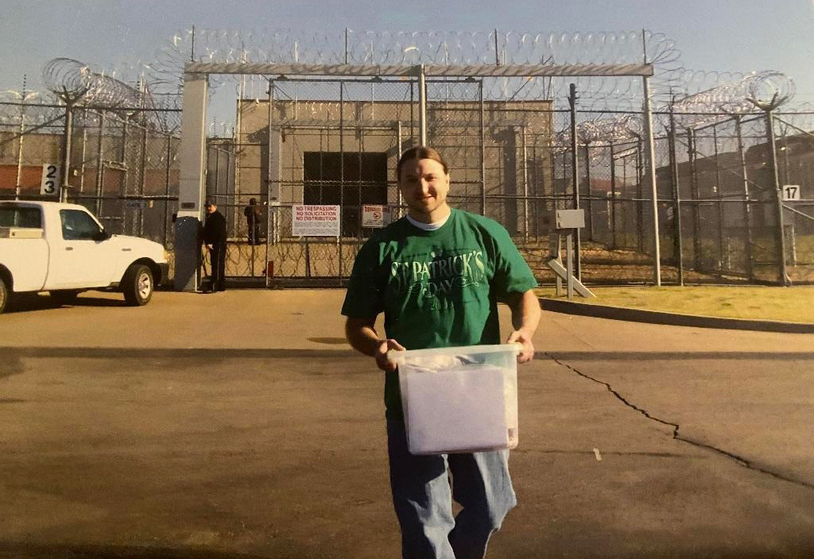
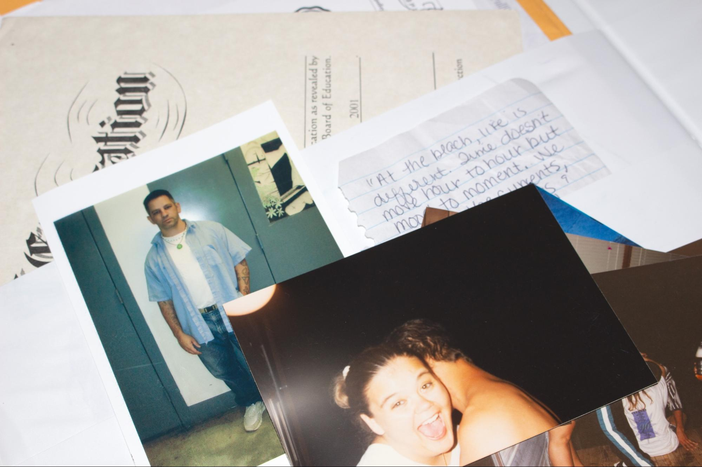
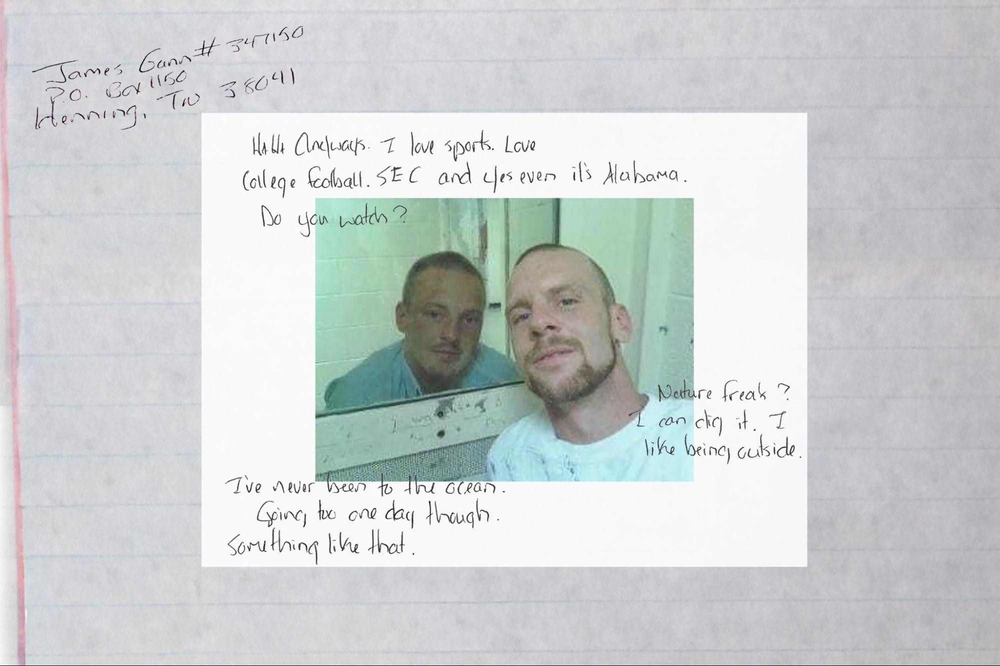
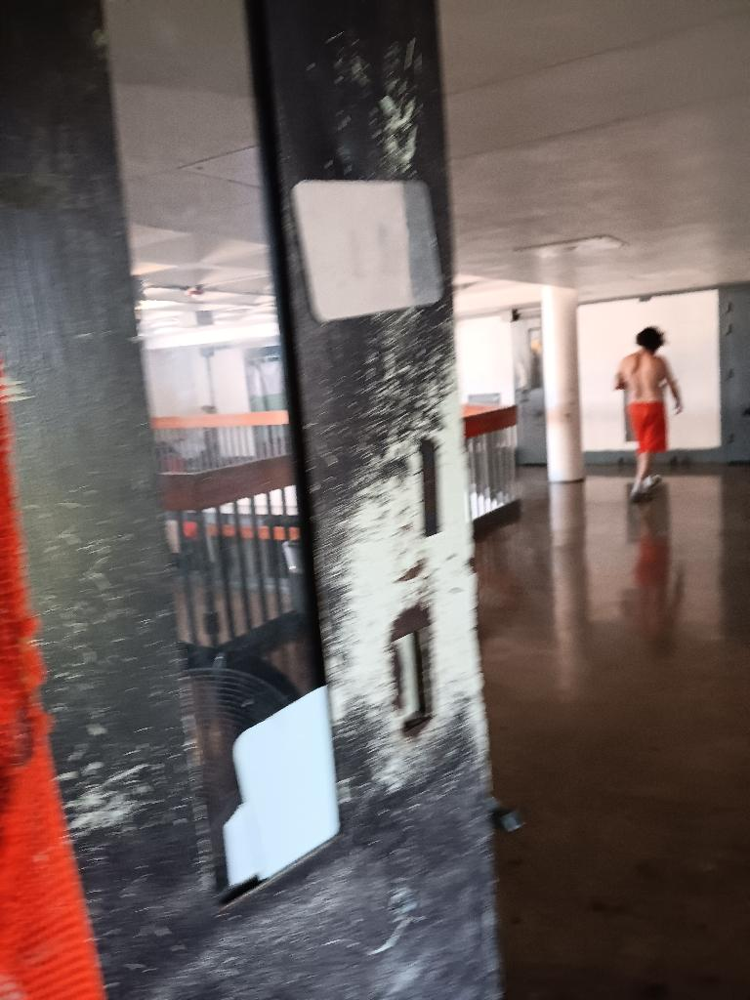
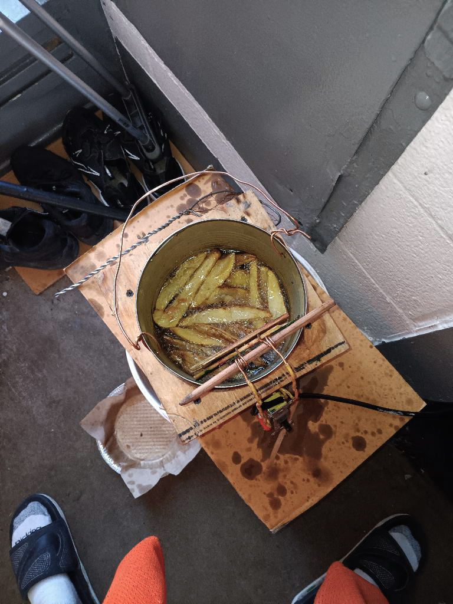
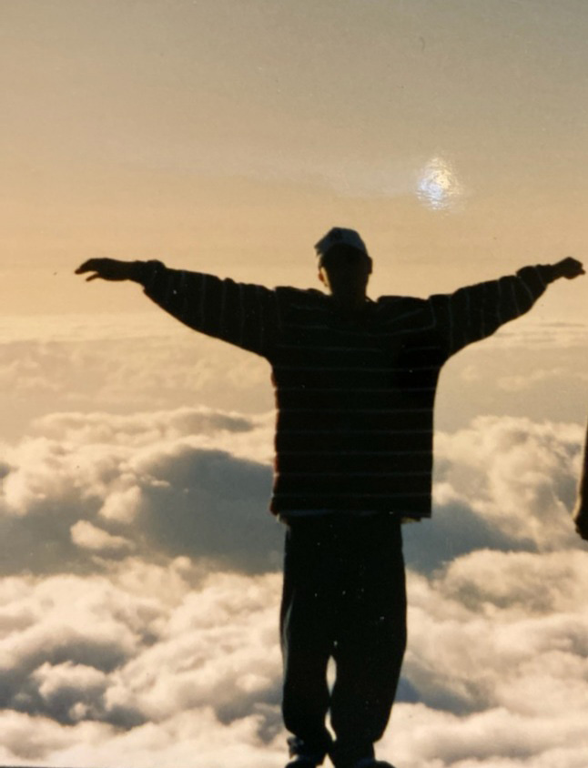

Artist Statement : 

What does it mean to offer understanding to people we have been taught not to empathize with? And what does it reveal about us when we decide someone no longer deserves compassion? These questions shape the way I examine the images and systems that dictate how we see incarcerated people. My perspective is rooted in growing up around people my mom was connected to in some form or fashion, many of whom had been incarcerated. Everything I create centers on people I have a personal connection to - individuals who entered my life through her past relationships. When I was younger, people joked that she “loves damaged people,” but as I got older, I recognized that what others mocked was actually her refusal to strip people of their humanity. Her instinct for compassion taught me to look past stereotypes and question the narratives that frame prisoners as one-dimensional.
A mugshot often becomes the entire story. One frame can erase a person’s upbringing, environment, and the pressures that shaped their decisions. These images appear objective, yet they are circulated by institutions invested in reducing people to their worst moment. The source material I engage with, public databases, news archives, state records, reveals how easily systems release information designed to dehumanize and how readily society accepts this flattening. The gap between public narratives of “justice” and the lived reality of incarceration is wide: cages labeled as rehabilitation, economies built on containment, and a constant expectation that people should somehow rebuild their lives while carrying permanent barriers to employment, housing, and social acceptance. The idea of “serving your time” collapses when the consequences persist long after release.
Ultimately, the work challenges the instinct to simplify, judge, and distance. If we were handed the same life, the same pressures, the same absence of support, would our choices truly look different? Holding that question forces a shift in how we read images and how easily we accept the criminal labels assigned to others. By reframing the visual language surrounding incarceration, the work insists on acknowledging the full complexity of people’s circumstances and pushes against the belief that a single moment defines a life. What emerges is a space for reconsidering how we understand humanity and how deeply our systems, and our own instincts, determine who is granted empathy in the first place.

Selected Photos :

